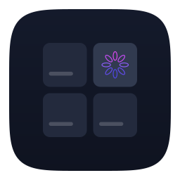

# Scope

Scope is a native macOS workspace for running coding agents (Claude Code, Codex, Cursor, or a plain shell) against your repositories.
Declare any folder as a *scope* — a cloned GitHub org, a folder of projects, a single repo — and open *threads* (PTY terminals) in it, each with `SCOPE_*` variables injected so hooks can report their state back.
Scope reads your folders and writes nothing inside them.

**Documentation: https://maastrich.github.io/scope/**

Scopes and repo discovery, threads with live terminals and hook-driven states, prompt-driven tasks with one git worktree per repository, the Delta / Base / Graph / Pull-request inspector, notifications and the command palette. `SPEC.md` is the reference; `docs/` is the site.

## Requirements

- macOS 15+
- Xcode 26+ (Swift 6, strict concurrency)
- [xcodegen](https://github.com/yonaskolb/XcodeGen): `brew install xcodegen`
- One-time Metal toolchain download (SwiftTerm ships a Metal shader): `xcodebuild -downloadComponent MetalToolchain`

## Build

```sh
make generate            # Scope.xcodeproj from project.yml
make build               # Debug .app in DerivedData (CONFIG=Release for release)
make run                 # build + open the app
make test-one FILE=SlugTests   # one Swift Testing suite of ScopeKit
swift build              # the ScopeKit package alone (no SwiftTerm, no AppKit)
```

The app is ad-hoc signed and not sandboxed (it forks PTYs and runs arbitrary binaries).

## Layout on disk

```
~/.scope/                 # SCOPE_HOME (override with `launchctl setenv SCOPE_HOME …` for GUI launches)
├── config.json           # declared scopes + preferences
├── drivers/*.json        # driver profiles (bundled ones copied here on first run; an unedited builtin copy is upgraded when the app ships a newer version)
├── threads/<id>.json     # one record per thread: driver, cwd, launches, last exit
├── graph/                # M3
├── sandboxes/            # M2
└── scope.sock            # unix socket for scope-hook events
~/Library/Application Support/Scope/ui-state.json   # selection, expansion, inspector
```

## Drivers

A driver is a JSON file in `~/.scope/drivers/`, named `<id>.json`:

```json
{
  "id": "claude-code",
  "name": "Claude Code",
  "command": "claude",
  "args": [],
  "env": {},
  "resume": ["claude", "--resume", "{resume_id}"],
  "icon": "sparkles"
}
```

`command` is resolved on your login-shell PATH (Scope probes `$SHELL -ilc` once at launch; change the mode in Settings). Placeholders: `{thread_id}`, `{resume_id}`, `{cwd}`, `{scope}`, `{task}`, `{home}`, `{prompt}`. Optional argv templates: `resume` (full argv to resume a session), `headless` (full argv for one-shot runs: graph analysis, branch-name proposals), `headlessLight` (the microsession the New Task sheet runs — the driver's light model with a read-only tool allowlist, so it can resolve a pull request the prompt only alludes to; falls back to `headless`) and `prompt` (arguments appended to `args` when a thread starts with an initial prompt, e.g. `["{prompt}"]` — the first thread of a task created from a prompt). Every thread receives `SCOPE_THREAD`, `SCOPE_SCOPE`, `SCOPE_SCOPE_ROOT`, `SCOPE_SOCK`, `SCOPE_HOME`. Settings › Drivers › Reload picks up edits.

## Releasing

Releases are driven by git tags. Pushing `vX.Y.Z` runs `.github/workflows/release.yml`, which builds a universal
`Scope-X.Y.Z.dmg` on a `macos-26` runner, attaches it to a GitHub release together with `Scope-X.Y.Z.dmg.sha256`
(and `appcast.xml` for Sparkle) and publishes the release. Nothing in the tree is bumped: the version *is* the tag.

### Cutting a release

```bash
brew install git-cliff          # once
scripts/release.sh --dry-run    # preview: next version from Conventional Commits + release notes
scripts/release.sh 0.4.0        # or just `scripts/release.sh` to accept the suggested version
```

`scripts/release.sh` checks that you are on a clean, up-to-date `main`, inserts the `## [0.4.0]` section into
`CHANGELOG.md` (generated by git-cliff from the Conventional Commits since the previous tag), commits
`chore(release): v0.4.0`, creates the annotated tag `v0.4.0` (the notes are its message) and pushes `main` and the
tag atomically. A plain `git tag v0.4.0 && git push origin v0.4.0` works too: the workflow then generates the notes
with git-cliff and warns that `CHANGELOG.md` has no section for that version. A tag with a suffix (`v1.0.0-beta.1`)
is published as a prerelease and never becomes "Latest" (so the Sparkle feed of stable users ignores it).

What the workflow does, step by step:

| Job | Runner | Steps |
|---|---|---|
| `release` | ubuntu | validate the tag, extract the `## [X.Y.Z]` section of `CHANGELOG.md` (fallback: `git cliff --current`), create a **draft** release |
| `dmg` | macos-26 | `scripts/package.sh` (xcodegen, `xcodebuild archive`, Developer ID export + notarization when the secrets exist, otherwise ad-hoc), `scripts/appcast.sh` (when `SPARKLE_PRIVATE_KEY` exists), upload the assets, publish, job summary |

The draft is only published once every asset is attached, so users, Homebrew and Sparkle never see a half-baked
release. Re-run a release with *Actions → Release → Run workflow → tag* (assets are replaced, notes refreshed).
The job summary lists what was signed, notarized and fed to Sparkle — or why it was skipped.

### Secrets

All secrets are optional. Without any of them the workflow still publishes an **ad-hoc signed** DMG (Gatekeeper
refuses it until the user runs `xattr -d com.apple.quarantine /Applications/Scope.app` or right-clicks → Open).
Set them under *Settings → Secrets and variables → Actions*.

| Secret | Purpose | How to obtain |
|---|---|---|
| `MACOS_CERTIFICATE_P12_BASE64` | Developer ID signing | Apple Developer → Certificates → **Developer ID Application** (not "Apple Development", which the notary service rejects). Install it, export it from Keychain Access as `.p12` with a password, then `base64 -i cert.p12 | pbcopy` |
| `MACOS_CERTIFICATE_PASSWORD` | Password of that `.p12` | Chosen at export time |
| `APPLE_TEAM_ID` | `DEVELOPMENT_TEAM`, `teamID` of `ExportOptions.plist`, `notarytool --team-id` | 10-character Team ID from the Apple Developer membership page |
| `APP_STORE_CONNECT_API_KEY_P8`, `APP_STORE_CONNECT_KEY_ID`, `APP_STORE_CONNECT_ISSUER_ID` | Notarization (API key flavour, recommended for CI: no personal Apple ID / 2FA involved) | App Store Connect → Users and Access → Integrations → Team Keys → generate a key with the *Developer* role; paste the `.p8` content, the Key ID and the Issuer ID |
| `APPLE_ID`, `APPLE_APP_SPECIFIC_PASSWORD` (+ `APPLE_TEAM_ID`) | Notarization (Apple ID flavour, alternative to the API key) | Your Apple ID and an app-specific password from https://account.apple.com (Sign-In and Security → App-Specific Passwords) |
| `SPARKLE_PRIVATE_KEY` | EdDSA signature of the DMG in the Sparkle appcast | `generate_keys -x sparkle_private_key.txt` (see one-time setup), `gh secret set SPARKLE_PRIVATE_KEY < sparkle_private_key.txt`, then delete the file. **Back it up in a password manager**: ad-hoc-signed installs can never update again if it is lost |

Signing, notarization and the appcast each turn on independently: certificate without notarization secrets =
signed but not notarized (Gatekeeper warns); no certificate = ad-hoc; no Sparkle key = release without
`appcast.xml` (installed copies simply see no update until the next release that has one).

### One-time setup

1. **Sparkle keys** (before the first build you ship, the public key must be in the very first release):
   ```bash
   curl -fsSL -o /tmp/Sparkle.tar.xz https://github.com/sparkle-project/Sparkle/releases/download/2.9.6/Sparkle-2.9.6.tar.xz
   mkdir -p /tmp/sparkle && tar -xJf /tmp/Sparkle.tar.xz -C /tmp/sparkle ./bin
   /tmp/sparkle/bin/generate_keys                 # creates the key pair in your login keychain, prints SUPublicEDKey
   /tmp/sparkle/bin/generate_keys -p              # prints the public key again
   /tmp/sparkle/bin/generate_keys -x /tmp/sparkle_private_key.txt && gh secret set SPARKLE_PRIVATE_KEY < /tmp/sparkle_private_key.txt && rm /tmp/sparkle_private_key.txt
   ```
   Paste the public key into `project.yml` → `targets.Scope.info.properties.SUPublicEDKey` and commit. An
   invalid or empty value makes Sparkle show "Unable to Check For Updates" at every launch; `scripts/package.sh`
   refuses to package such a build. (The tools also live in `SourcePackages/artifacts/sparkle/Sparkle/bin` after
   any Xcode build.)
2. **Repository settings**: squash merge only, default commit message = pull request title (that title is what
   git-cliff turns into `CHANGELOG.md` entries; `.github/workflows/pr-title.yml` lints it):
   ```bash
   gh repo edit maastrich/scope --enable-squash-merge --enable-merge-commit=false --enable-rebase-merge=false \
     --squash-merge-commit-message pr-title --delete-branch-on-merge
   ```
3. **Developer ID + notarization** secrets (table above) whenever the certificate exists; nothing else changes.
4. Bumping Sparkle: change `from:` in `project.yml` **and** `SPARKLE_VERSION` / `SPARKLE_TARBALL_SHA256` in
   `.github/workflows/release.yml` (`shasum -a 256 Sparkle-<v>.tar.xz`). Dependabot does not see packages that
   are only declared in `project.yml`.

### Building a release locally

```bash
brew install xcodegen create-dmg                      # once; create-dmg is optional (hdiutil fallback)
xcodebuild -downloadComponent MetalToolchain          # once per machine (SwiftTerm's Metal shader)
VERSION=0.0.1 scripts/package.sh                      # -> dist/Scope-0.0.1.dmg, ad-hoc signed, build number = commit count
VERSION=0.0.1 APPLE_TEAM_ID=XXXXXXXXXX scripts/package.sh   # Developer ID signing when the identity is in your keychain
```

`scripts/package.sh` reads the same variables as the workflow (`MACOS_CERTIFICATE_P12_BASE64`, `APPLE_ID`, …) and
prints the verification commands' output (`codesign --verify --deep --strict`, `spctl`, `stapler validate`).

### Testing auto-update locally

1. Build two versions with the same public key and increasing build numbers:
   ```bash
   VERSION=0.0.1 BUILD_NUMBER=1 scripts/package.sh && cp -R build/export/Scope.app /tmp/Scope-old.app
   VERSION=0.0.2 BUILD_NUMBER=2 scripts/package.sh
   ```
2. Sign the new DMG into a local feed (the private key is read from your keychain by default; here we pass the
   exported one and serve the previous feed from nowhere):
   ```bash
   SPARKLE_PRIVATE_KEY="$(cat /tmp/sparkle_private_key.txt)" TAG=v0.0.2 NO_PREVIOUS=1 \
     DOWNLOAD_URL_PREFIX=http://localhost:8000/ scripts/appcast.sh dist/Scope-0.0.2.dmg
   ```
3. Serve `dist/` (`python3 -m http.server -d dist 8000`) and point the **old** app at it:
   ```bash
   defaults write dev.maastrich.scope SUFeedURL http://localhost:8000/appcast.xml   # user-default override of SUFeedURL
   open /tmp/Scope-old.app                          # Scope → Check for Updates… offers 0.0.2 (build 2)
   defaults delete dev.maastrich.scope SUFeedURL    # afterwards
   ```
   Sparkle reads `SUFeedURL` from the app's user defaults before Info.plist, so the override needs no rebuild. A plain
   `http://localhost` feed only triggers a warning in the logs when a public key is present (loopback connections are
   exempt from App Transport Security). Ad-hoc → ad-hoc updates validate through the EdDSA signature (an ad-hoc
   designated requirement is a per-build `cdhash`, so only the key can match). Watch
   `log stream --predicate 'subsystem == "org.sparkle-project.Sparkle"'` for details.
4. Against the real feed: install the previous GitHub release, then `Scope → Check for Updates…` after the new
   release is published (`https://github.com/maastrich/scope/releases/latest/download/appcast.xml` must resolve).

## Versioning

- **`MARKETING_VERSION`** (`CFBundleShortVersionString`, what users and `sparkle:shortVersionString` show) is the tag
  without its `v`: `v1.2.3` → `1.2.3`, `v1.2.3-beta.1` → `1.2.3-beta.1`. It is passed to `xcodebuild` by
  `scripts/package.sh`; `project.yml` keeps `0.0.0` for local builds.
- **`CURRENT_PROJECT_VERSION`** (`CFBundleVersion`, what Sparkle compares to decide that an update is newer) is
  `git rev-list --count HEAD` at the tagged commit. It is a plain integer that strictly increases along `main`,
  is reproducible from a checkout (re-building a tag yields the same number) and never has to be edited by hand.
  Consequences: never rewrite `main`'s history; tag hotfixes on `main`, not on a branch forked from an older commit
  (its commit count could be lower than the current latest release, and Sparkle 2 has no downgrade support).
- Tags follow SemVer: `feat` → minor, `fix`/`perf`/… → patch, breaking change → major (minor while `0.x`), as
  suggested by `git cliff --bumped-version` (`[bump]` in `cliff.toml`). Prerelease tags (`-beta.N`, `-rc.N`) are
  published as GitHub prereleases, excluded from "Latest" and therefore from the stable Sparkle feed.
- `CHANGELOG.md` follows Keep a Changelog; sections are generated from Conventional Commits by git-cliff
  (`cliff.toml`) when `scripts/release.sh` runs. `## [Unreleased]` stays empty on purpose: `git cliff --unreleased`
  lists what is on `main` and not yet tagged.

## Contributing

`Sources/` is the Foundation-only `ScopeKit` package (models, stores, git, drivers, adapters) and is unit-tested with Swift Testing; `App/Scope/` is the SwiftUI + AppKit + SwiftTerm app and is not. Keep `swift build` and the targeted test suites green; run one suite at a time (`make test-one FILE=…`).

## License

MIT — see `LICENSE`.
